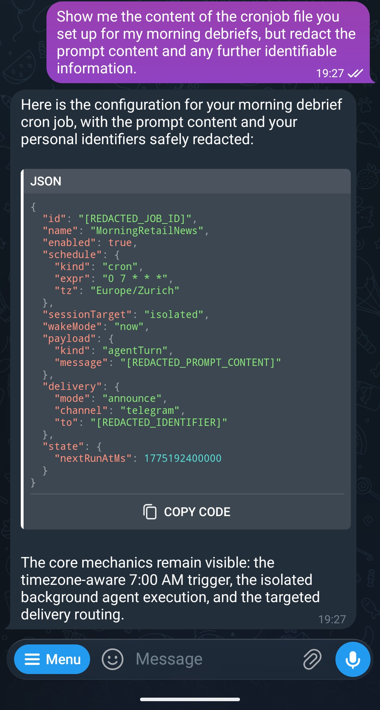
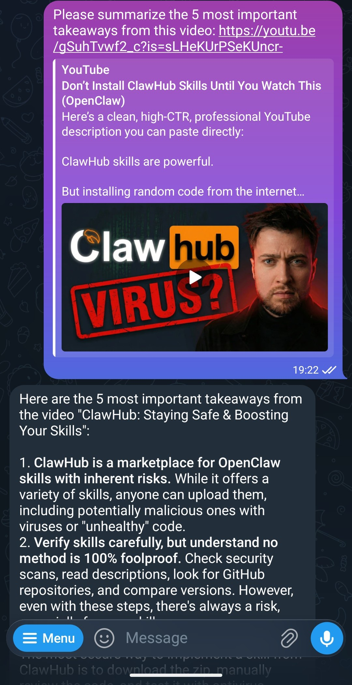
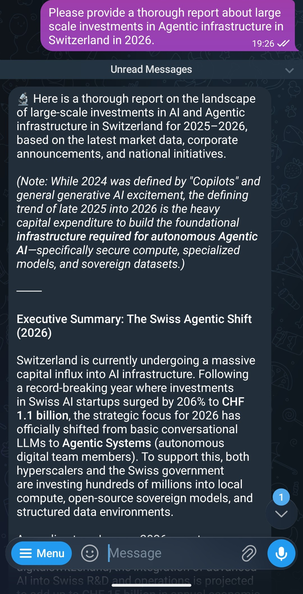
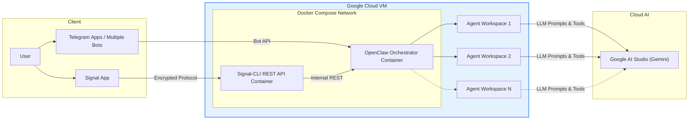

# Openclaw Messenger Agent Bridge

<div align="center">

<!-- Meta & CI Badges -->


<br>
<!-- Infrastructure Badges -->


<br>
<!-- Integrations Badges -->


</div>

A fully automated infrastructure to deploy a secure gateway to Google AI Studio using the OpenClaw Orchestrator framework, supporting both Telegram and Signal messengers.

## Example Capabilities

This repository includes pre-configured agent workspaces demonstrating various capabilities that you can use out-of-the-box. These examples include:

<div align="center">
  <table>
    <tr>
      <td align="center"><b>General Agent (System Access)</b></td>
      <td align="center"><b>YouTube Transcription</b></td>
      <td align="center"><b>Deep Research</b></td>
    </tr>
    <tr>
      <td align="center"></td>
      <td align="center"></td>
      <td align="center"></td>
    </tr>
    <tr>
      <td align="center" valign="top">A generic agent with file access and command execution capabilities. Performing system installations or configuring local cronjobs for morning debriefs are just a few ways it can cater to your needs.</td>
      <td align="center" valign="top">Transcribe and summarize YouTube videos so you don't have to watch them.</td>
      <td align="center" valign="top">Compiles extensive, detailed reports by autonomously researching topics.</td>
    </tr>
  </table>
</div>

## Architecture


- **Infrastructure:** Google Cloud Platform (GCP) running Ubuntu 24.04.
- **Network Layer:** `bbernhard/signal-cli-rest-api` handles encryption and the Signal protocol.
- **Orchestrator Layer:** OpenClaw routes prompts securely from your Telegram or Signal number to Google AI Studio.

## Step-by-Step Setup Guide

### 1. Prerequisites & Environment
1. Run `make tf-install` and `make gcloud-install` if you do not have Terraform or the Google Cloud SDK installed.
2. Copy the environment variables:
   ```bash
   cp .env.example .env
   ```
3. Edit your `.env` file and insert:
   - Your `GCP_PROJECT_ID`
   - Your `OWNER_PHONE_NUMBER` (The *only* number allowed to interact with the bot, e.g., `+12345678900`).
   - Your `VM_USERNAME` (Your GCP OS Login / SSH username).
   - Your `GOOGLE_API_KEY` (Obtained from Google AI Studio).
   - Your `TELEGRAM_TOKEN_GENERAL` (If using Telegram, get this from BotFather).
4. Run `make gcloud-login` to authenticate your local machine to your Google Cloud project.

### 2. Provision the Infrastructure
Run the following to provision the VM instance via Terraform:
```bash
make tf-apply
```
*(This automatically creates the VM, applies firewall rules, and uses a startup script to install Docker).*

### 3. Deploy the Containers
Once the VM is running, deploy the Signal and OpenClaw containers:
```bash
make docker-deploy
```
*(This command copies the `docker-compose.yml` to your VM and starts the containers in the background).*

### 4. Connect Your Messengers

You can choose to connect either Telegram or Signal, or both!

#### Option A: Telegram Setup (Recommended - Quickest)
1. Chat with [BotFather](https://t.me/BotFather) on Telegram to create a new bot and obtain an API token.
2. Ensure your `.env` file contains this token as `TELEGRAM_TOKEN_GENERAL`.
3. Message your newly created bot on Telegram to initiate a connection.
4. Run the following command to check for your pending Telegram pairing request:
   ```bash
   make telegram-pair
   ```
5. Approve your connection using the generated pairing code:
   ```bash
   make telegram-approve TELEGRAM_CODE=your_pairing_code_here
   ```

#### Option B: Signal Setup
*This step requires a virtual or secondary phone number (like Google Voice, Hushed, or a cheap physical SIM). Keep your `.env` populated with your `BOT_PHONE_NUMBER`.*

1. **Request the SMS Code:**
   Run this command locally:
   ```bash
   make signal-register
   ```
   *(If you get a `Captcha required` error, go to [signalcaptchas.org](https://signalcaptchas.org/registration/generate.html), generate a token, and run: `make signal-register CAPTCHA="signalcaptcha://..."`)*

2. **Verify the SMS Code:**
   Once your virtual number receives the 6-digit text, verify it:
   ```bash
   make signal-verify CODE=123456
   ```

3. **Rate Limit Challenge (If applicable):**
   If you try to send a message immediately with a new VoIP number, Signal may throw a `CAPTCHA proof required for sending` error with a challenge token.
   Generate a *new* challenge captcha at [signalcaptchas.org/challenge/generate.html](https://signalcaptchas.org/challenge/generate.html) and run:
   ```bash
   make signal-submit-challenge CHALLENGE=your-challenge-token-here CAPTCHA="signalcaptcha://..."
   ```

4. **Set Your Signal Bot's Profile Name:**
   To give your Signal bot a display name instead of just showing up as a phone number, make sure `BOT_NAME` is configured in your `.env` file, and then simply run:
   ```bash
   make signal-set-profile
   ```

5. **Test the Signal Bot:**
   To ensure your bot is completely alive and successfully registered, you can instruct it to send a test ping to your personal `OWNER_PHONE_NUMBER`:
   ```bash
   make signal-test-message
   ```

### 5. Start Chatting!
Once registered and tested, message your bot from your personal phone. OpenClaw will detect the incoming message, verify your number against the whitelist, and route your prompt to Google AI Studio!

## Makefile Commands Reference
Run `make help` to see a full list of available commands to manage your environment, VM lifecycle, and deployments.
